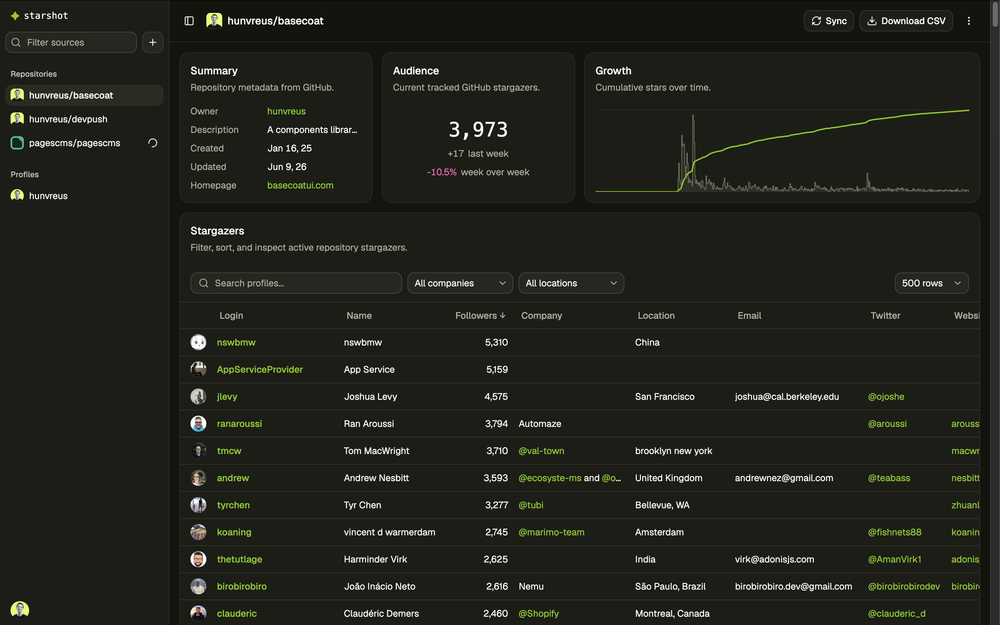

<picture>
  
</picture>

# starshot

Local web app for collecting, inspecting, and exporting GitHub audience data.

starshot tracks two source types:

- GitHub repository stargazers
- GitHub profile followers

Each source gets a local dashboard with source metadata, audience counts, searchable profile rows, CSV export, and update/rate-limit status.

## Quickstart

starshot requires a GitHub OAuth App before local sign-in will work.

Create one at [github.com/settings/developers](https://github.com/settings/developers):

1. Click **New OAuth App**.
2. Set **Homepage URL** to `http://127.0.0.1:5173`.
3. Set **Authorization callback URL** to `http://127.0.0.1:5173/api/auth/callback/github`.
4. Copy the client ID and generate a client secret.

```bash
pnpm install
cp .env.example .env
# Edit .env and set GITHUB_CLIENT_ID and GITHUB_CLIENT_SECRET.
pnpm dev
```

Open `http://127.0.0.1:5173`.

starshot creates and migrates `data/starshot.sqlite` on server startup.

## Common commands

```bash
pnpm dev        # Run the local Express/Vite app.
pnpm typecheck  # Run TypeScript checks.
pnpm test       # Run Vitest tests.
pnpm build      # Typecheck and build the client.
pnpm start      # Run the production server.
```

## How it works

1. Sign in with GitHub.
2. Add a repository or profile source.
3. Run an update.
4. starshot reconciles the stargazer or follower list from GitHub.
5. starshot stores membership changes locally and can refresh profile metadata separately.
6. The dashboard reads the cached data from SQLite.

Repository pages show repository metadata, tracked stargazer counts, week-over-week stargazer growth, and a growth chart.

Profile pages show profile metadata, GitHub follower/following counts, and tracked follower rows.

The profile table supports search, company/location facets, sorting, pagination, and CSV export. Rows include GitHub login, name, follower count, company, location, email, Twitter, website, and bio.

## Updates and rate limits

Updates are queued in SQLite and processed by the local server. Starting an update returns immediately; the background scheduler claims queued runs up to `SYNC_CONCURRENCY`.

During an update, starshot shows status alerts for:

- queued or running updates
- membership reconciliation or profile refresh progress
- GitHub request throttling
- GitHub rate-limit pauses

GitHub rate-limit state is process-local and based on observed response headers. It is not coordinated across multiple running starshot server processes.

## Data and reset

The local database lives at:

```text
data/starshot.sqlite
```

This file contains local app data, Better Auth session records, and GitHub OAuth tokens for the signed-in account. Treat it as private.

To reset all local data, stop the server and delete:

```bash
rm -f data/starshot.sqlite data/starshot.sqlite-wal data/starshot.sqlite-shm
```

Restarting the app recreates an empty database.

## Environment variables

| Name | Required | Default | Description |
| --- | --- | --- | --- |
| `GITHUB_CLIENT_ID` | Yes | None | Client ID from the GitHub OAuth App used for local sign-in. |
| `GITHUB_CLIENT_SECRET` | Yes | None | Client secret from the GitHub OAuth App used for local sign-in. |
| `BETTER_AUTH_SECRET` | No | `starshot-local-dev-secret-change-me` | Secret used by Better Auth. Set a private value if other people can access your local app or database. |
| `BETTER_AUTH_URL` | No | `http://{HOST}:{PORT}` | Public base URL used by Better Auth. Set this if the app is not served from the local host and port defaults. |
| `HOST` | No | `127.0.0.1` | Host address for the local server. |
| `PORT` | No | `5173` | Port for the local server. |
| `GITHUB_PROFILE_CACHE_TTL_DAYS` | No | `90` | Freshness window for cached GitHub user profiles. Set to `0` to keep cached profiles indefinitely. |
| `GITHUB_REPO_CACHE_TTL_DAYS` | No | `1` | Freshness window for cached GitHub repository metadata. Set to `0` to keep cached repository records indefinitely. |
| `GITHUB_PROFILE_CONCURRENCY` | No | `16` | Number of stale GitHub profiles a profile refresh updates in parallel. |
| `SYNC_CONCURRENCY` | No | `4` | Number of update runs the SQLite queue may run at once. |
| `SYNC_KNOWN_BOUNDARY_COUNT` | No | `200` | Number of consecutive known active stargazers the optimized update probe must see before it can stop early. |
| `UPDATE_PROBE_MAX_PAGES` | No | `5` | Maximum GitHub stargazer pages an optimized update probes before falling back to full reconciliation. |
| `GITHUB_HTTP_CONCURRENCY` | No | `40` | Total in-flight GitHub HTTP requests across the process. |
| `GITHUB_TOKEN_CONCURRENCY` | No | `10` | In-flight GitHub HTTP requests per token. |
| `GITHUB_RATE_LIMIT_SLOW_FLOOR` | No | `500` | Slows GitHub requests when observed remaining core quota is at or below this value. |
| `GITHUB_RATE_LIMIT_PAUSE_FLOOR` | No | `100` | Pauses GitHub requests until reset when observed remaining core quota is at or below this value. |
| `GEOCODING_ENABLED` | No | `false` | Enables location normalization for GitHub profile locations. |
| `GEOCODING_PROVIDER` | No | `nominatim` | Geocoding provider. Only `nominatim` is currently supported. |
| `GEOCODING_EMAIL` | Only when geocoding is enabled | None | Contact email sent to Nominatim. This is not an API key. |
| `GEOCODING_CACHE_TTL_DAYS` | No | `0` | Freshness window for normalized geocoding results. `0` keeps cached geocoding records indefinitely. |

When geocoding is enabled, starshot stores the raw GitHub location plus normalized location, country, country code, latitude, and longitude. Nominatim is free but rate-limited.

## Documentation

- [Architecture](ARCHITECTURE.md)

## License

[MIT](LICENSE)
